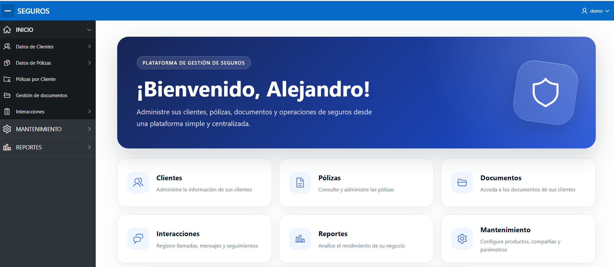
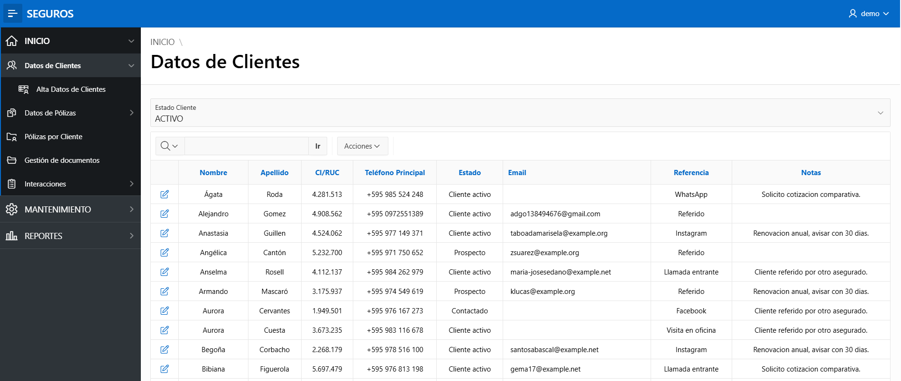
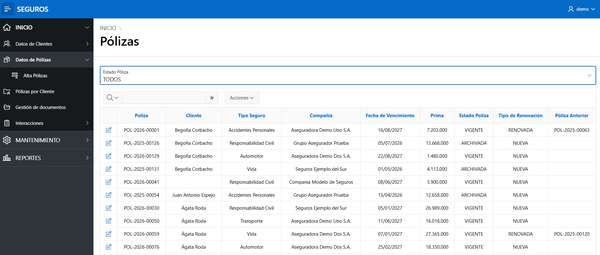
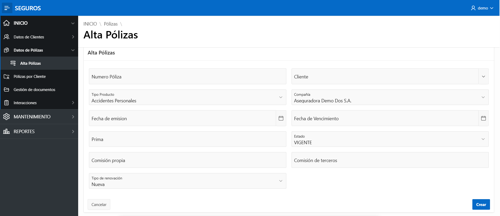
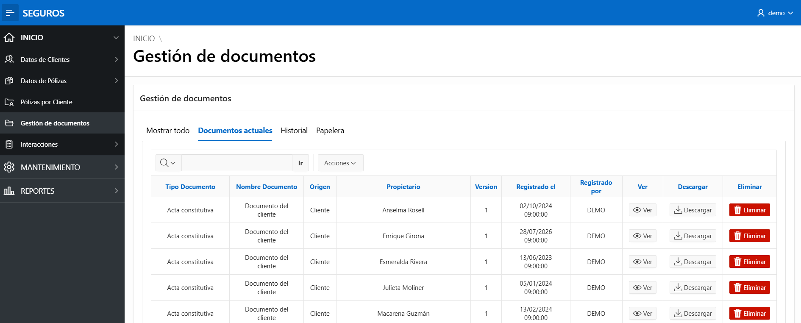
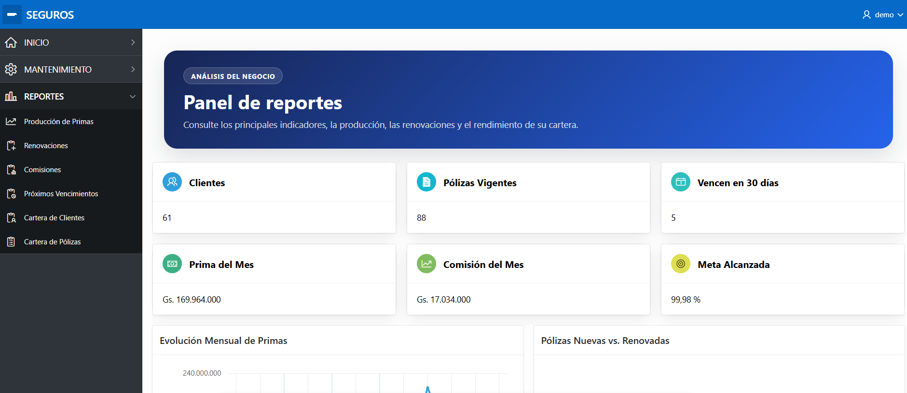
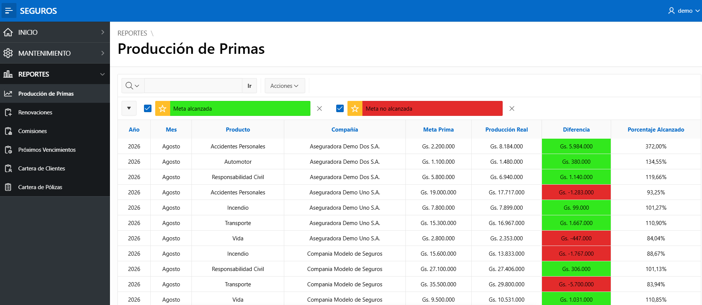

# SEGUROS — Insurance CRM

A customer and policy management system built with Oracle APEX for an
independent insurance brokerage in Paraguay. It replaced a spreadsheet and
WhatsApp workflow with one place to manage clients, policies, documents and
renewals.

**Live demo:** (https://yncsrorstcbwykr-listingadgo.adb.us-ashburn-1.oraclecloudapps.com/ords/r/seguros_demo/seguros/login)
**Login:** DEMO / Paraguay2026Crm

All data shown is synthetic. No real client information is included.

---

## Screenshots

**Home**

**Clients** — individuals and companies, with lifecycle stage and lead source.

**Policies** — product, insurer, premium, expiration and renewal chain.

**New policy**

**Documents** — versioned, with history and a recycle bin.

**Reports dashboard** — active policies, renewals due in 30 days, premium and
commission for the month, and progress against target.

**Production vs. target** — by product and insurer, highlighted green or red.

---

## Features

- Clients: individuals and companies, lifecycle stages, lead sources
- Policies: premiums, commissions, renewal chains linking each policy to the one it replaced
- Documents: versioning, soft delete with audit trail, expiration dates
- Renewal alerts for policies expiring within 30 days
- Monthly production targets by product and insurer
- Interaction log by channel (WhatsApp, call, email, in person)

---

## Tech stack

| Layer | Technology |
|---|---|
| Application | Oracle APEX 24.2 (33 pages) |
| Database | Oracle Autonomous Database |
| Logic | SQL and PL/SQL |
| Authentication | APEX Accounts |

---

## Files

| File | What it is |
|---|---|
| `SEGUROS_DDL.sql` | Database schema: 11 tables, indexes, sequences, triggers |
| `f103_1.sql` | APEX application export (33 pages) |

---

## Running it

1. Create a schema with `CONNECT` and `RESOURCE` and a quota on `DATA`
2. Create an APEX workspace mapped to that schema
3. Run `SEGUROS_DDL.sql` in SQL Workshop to create the tables
4. Import `f103_1.sql` in App Builder, choosing that schema as the parsing schema
5. Create an APEX account to log in with

The repository contains the schema and the application, not the data. Use the
live demo above to see it populated.

---

## License

_Add a license before publishing._
